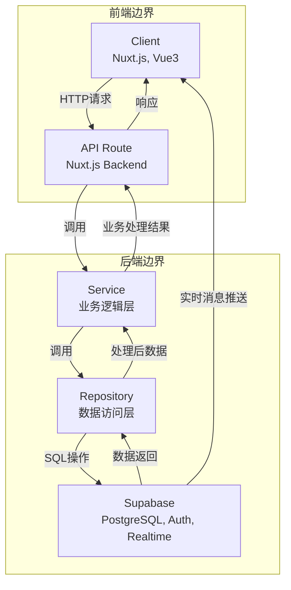

# Nexus Chat (极速社交助手) - 系统架构图

## 架构分层

## 架构说明

### 1. 前端边界
- **Client**: 使用 Nuxt.js + Vue3 构建，负责 UI 展示和用户交互
- 与后端通过 HTTP 请求进行通信

### 2. 后端边界
- **API Route**: 作为 BFF (Backend for Frontend)，处理客户端请求，进行校验和参数转换，然后调用 Service 层
- **Service**: 纯业务逻辑层，处理核心业务，如发送消息、创建用户等
- **Repository**: 数据访问层，负责与数据库交互，封装 SQL 操作

### 3. 外部服务
- **Supabase**: 提供 PostgreSQL 数据库、身份验证和实时消息推送 (Pub/Sub) 功能
- 作为外部 PaaS 服务，位于后端边界之外

## 数据流
1. 客户端发送 HTTP 请求到 API Route
2. API Route 处理请求并调用 Service 层
3. Service 层执行业务逻辑并调用 Repository 层
4. Repository 层与 Supabase 进行 SQL 操作
5. Supabase 返回数据给 Repository 层
6. Repository 层处理数据后返回给 Service 层
7. Service 层处理业务逻辑后返回结果给 API Route
8. API Route 响应客户端请求
9. Supabase 通过实时消息推送功能直接与客户端通信