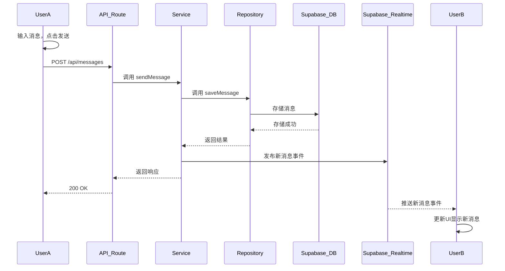

# Nexus Chat (极速社交助手) - 消息发送时序图

## 核心场景：用户 A 发送消息给用户 B

## 流程说明

1. **用户操作**：用户 A 在客户端输入消息并点击发送按钮
2. **HTTP 请求**：客户端向 API Route 发起 `POST /api/messages` 请求，包含消息内容和接收者 ID
3. **服务调用**：API Route 调用 Service 层的 `sendMessage` 方法
4. **数据存储**：Service 层调用 Repository 层的 `saveMessage` 方法，将消息存入 Supabase 数据库
5. **存储确认**：数据库返回存储成功的结果
6. **事件发布**：Service 层通过 Supabase Realtime 服务发布新消息事件到特定频道
7. **响应返回**：Service 层返回响应给 API Route，API Route 向客户端返回 200 OK
8. **实时推送**：Supabase Realtime 服务向订阅了该频道的用户 B 客户端推送新消息事件
9. **UI 更新**：用户 B 的客户端接收到事件，获取新消息并更新 UI

## 技术要点

- **同步调用**：HTTP 请求和方法调用采用同步方式，确保消息发送的可靠性
- **异步通知**：消息发布/订阅采用异步方式，实现实时消息推送
- **分层架构**：清晰的分层设计，确保职责分离和代码可维护性
- **数据持久化**：消息永久存储在 Supabase 数据库中
- **实时通讯**：利用 Supabase Realtime 服务实现消息的实时推送