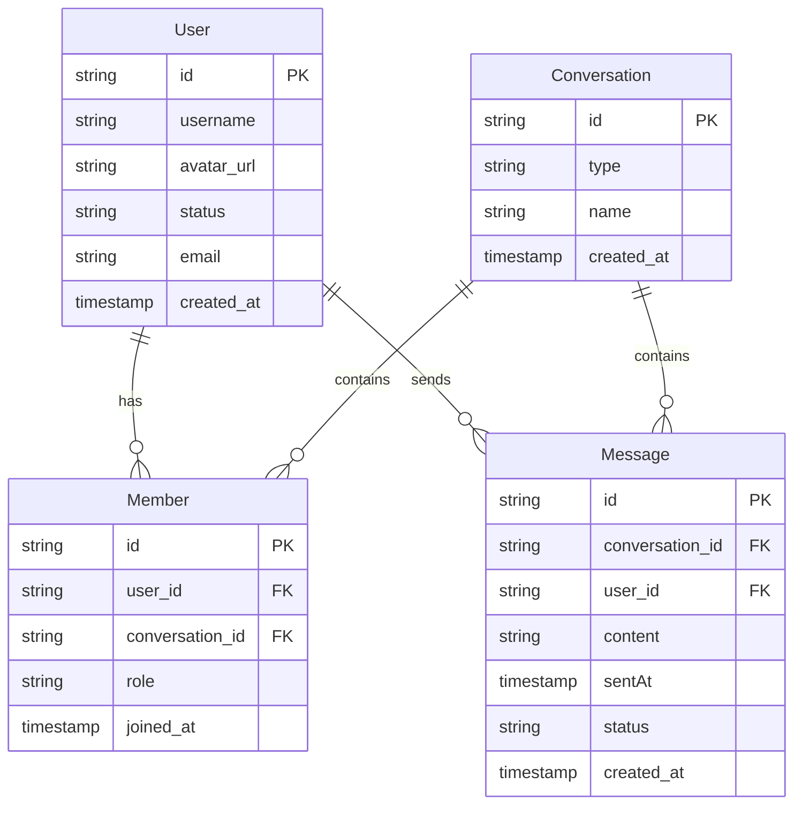
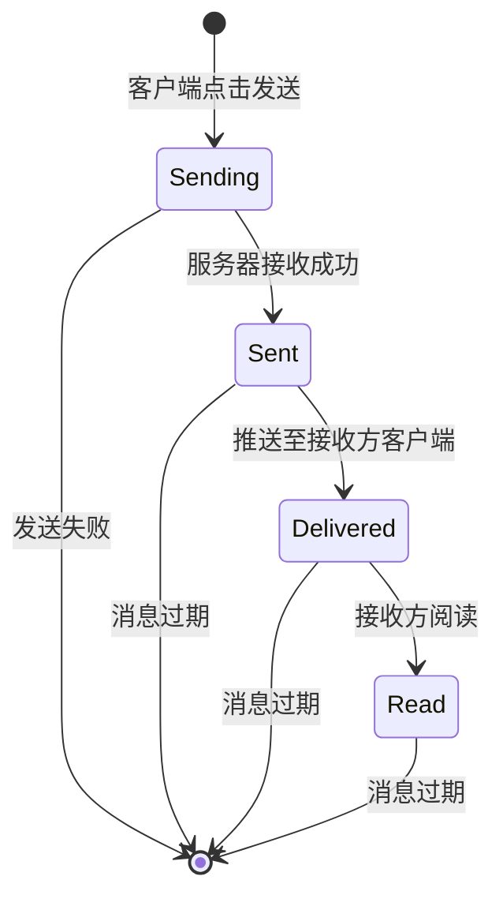

# 领域模型

## 1. Ubiquitous Language (统一语言)

### 核心术语

| 术语 | 解释 |
|------|------|
| User | 用户，系统的使用者，拥有唯一标识 |
| Conversation | 会话，用户之间的交流空间，可以是单聊或群聊 |
| Member | 成员，用户与会话之间的关联关系 |
| Message | 消息，用户在会话中发送的内容 |
| C2C | 单聊，两个用户之间的会话 |
| GROUP | 群聊，多个用户之间的会话 |
| Role | 角色，成员在会话中的身份，如普通成员或管理员 |
| Status | 状态，用户的在线状态或消息的生命周期状态 |
| SentAt | 发送时间，消息的发送时间戳 |
| JoinedAt | 加入时间，用户加入会话的时间戳 |

## 2. Core Domain Objects (核心领域对象)

### User (用户)
- **描述**：系统的使用者，拥有唯一标识
- **属性**：
  - id (主键，由Supabase Auth自动提供)
  - username (用户名，用于展示)
  - avatar_url (头像链接，用于显示头像)
  - status (在线状态，表示用户的在线情况)
  - email (邮箱)
  - created_at (创建时间)
- **行为**：
  - 参与多个会话
  - 发送消息

### Conversation (会话)
- **描述**：用户之间的交流空间，可以是单聊或群聊
- **属性**：
  - id (主键)
  - type (类型，区分单聊C2C和群聊GROUP)
  - name (群名称，用于群聊)
  - created_at (创建时间)
- **行为**：
  - 包含多个用户
  - 包含多条消息

### Member (成员)
- **描述**：用户与会话之间的关联关系
- **属性**：
  - id (主键)
  - user_id (外键，关联User)
  - conversation_id (外键，关联Conversation)
  - role (角色，区分普通成员和群管理员)
  - joined_at (加入时间)
- **行为**：
  - 连接用户和会话
  - 记录用户在会话中的角色

### Message (消息)
- **描述**：用户在会话中发送的内容
- **属性**：
  - id (主键)
  - conversation_id (外键，关联Conversation)
  - user_id (外键，关联User)
  - content (消息内容)
  - sentAt (发送时间，用于确定顺序)
  - status (消息状态，追踪生命周期)
  - created_at (创建时间)
- **行为**：
  - 由用户发送
  - 属于特定会话
  - 具有生命周期状态

## 3. Entity-Relationship Diagram (实体关系图)

## 4. Message State Machine (消息状态机)

### 消息生命周期说明

#### 状态定义

1. **Sending（发送中）**：
   - 客户端点击发送，消息正在上传到服务器的过程中
   - 此时客户端显示“发送中”状态

2. **Sent（已发送）**：
   - 服务器已成功接收并存储了这条消息
   - 此时可以给发送方一个“发送成功”的提示

3. **Delivered（已送达）**：
   - 消息已被成功推送到接收方的某个客户端
   - 表示消息已经到达接收方设备

4. **Read（已读）**：
   - 接收方已经阅读了这条消息
   - 发送方可以看到消息已被阅读的状态

#### 状态转换

- **[*] → Sending**：客户端点击发送按钮，开始上传消息
- **Sending → Sent**：服务器成功接收并存储消息
- **Sent → Delivered**：消息通过推送服务送达接收方客户端
- **Delivered → Read**：接收方打开并阅读消息
- **Sending → [*]**：发送过程中出现网络错误等导致发送失败
- **Sent → [*]**：消息超过保存期限被系统清理
- **Delivered → [*]**：消息超过保存期限被系统清理
- **Read → [*]**：消息超过保存期限被系统清理

## 5. Core Business Constraints (核心业务约束)

### 数据访问约束

1. **用户只能访问自己的数据**：
   - 用户只能查看和修改自己的个人信息
   - 用户只能查看自己参与的会话和相关消息
   - 实现方式：通过Supabase RLS (Row Level Security) 策略

2. **消息查询必须分页**：
   - 任何消息列表查询必须分页
   - 默认每页50条，按sentAt倒序拉取
   - 禁止一次性查询全部消息

3. **消息查询必须带conversation_id过滤**：
   - 所有消息查询必须包含conversation_id过滤条件
   - 确保消息查询的范围限定在特定会话内

### 业务逻辑约束

1. **会话类型约束**：
   - 单聊(C2C)会话只能有两个成员
   - 群聊(GROUP)会话可以有多个成员
   - 群聊必须设置群名称

2. **消息状态约束**：
   - 消息状态必须按照状态机定义的路径转换
   - 发送失败的消息可以重试
   - 消息状态变更必须实时更新

3. **成员角色约束**：
   - 群聊会话必须至少有一个管理员
   - 管理员可以添加/移除成员，修改群名称
   - 普通成员只能发送消息和查看会话信息

### 技术约束

1. **前端安全**：
   - 前端禁止使用Supabase service_role key
   - 前端只允许使用anon key
   - 需要管理员权限的操作必须走服务端route或server action

2. **实时通信**：
   - 实时订阅只做增量更新，禁止重复订阅
   - 首屏用服务端拉取，后续靠订阅
   - 订阅收到新消息只能做增量append，不允许每条消息触发全量refetch

3. **数据一致性**：
   - 所有服务函数与API route返回统一结构
   - 错误必须结构化返回，禁止直接throw给UI层
   - 实现事务处理，确保数据操作的原子性