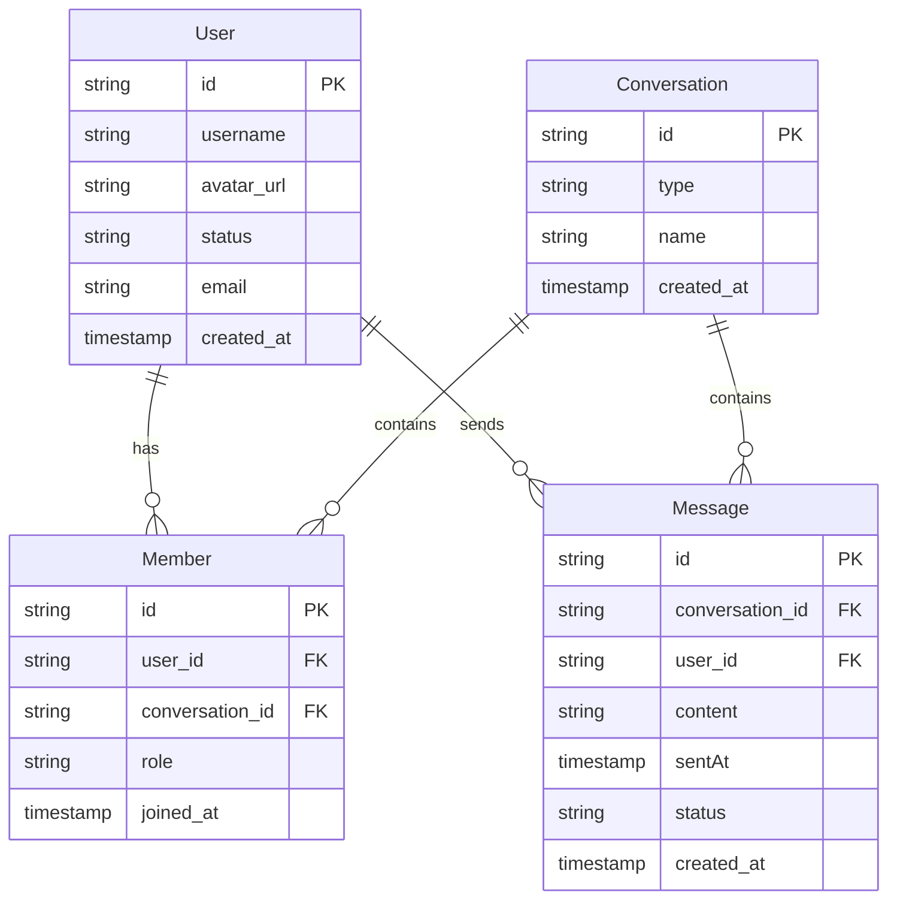

# 系统实体关系图

## 实体关系说明

1. **User（用户）**：
   - 可以参与多个Conversation（通过Member实体）
   - 可以发送多条Message
   - 属性：id（Supabase Auth自动提供）、username（用户名）、avatar_url（头像链接）、status（在线状态）、email、created_at

2. **Conversation（会话）**：
   - 包含多个User（通过Member实体）
   - 包含多条Message
   - 属性：id、type（区分单聊C2C和群聊GROUP）、name（群名称）、created_at

3. **Member（成员）**：
   - 连接User和Conversation的中间表
   - 记录用户加入会话的时间
   - 属性：id、user_id（外键）、conversation_id（外键）、role（角色，区分普通成员和群管理员）、joined_at

4. **Message（消息）**：
   - 由一个User发送
   - 属于一个Conversation
   - 属性：id、conversation_id（外键）、user_id（外键）、content（消息内容）、sentAt（发送时间）、status（消息状态）、created_at

## 主键和外键

- **User**：id（主键，由Supabase Auth自动提供）
- **Conversation**：id（主键）
- **Member**：id（主键），user_id（外键，关联User），conversation_id（外键，关联Conversation）
- **Message**：id（主键），user_id（外键，关联User），conversation_id（外键，关联Conversation）