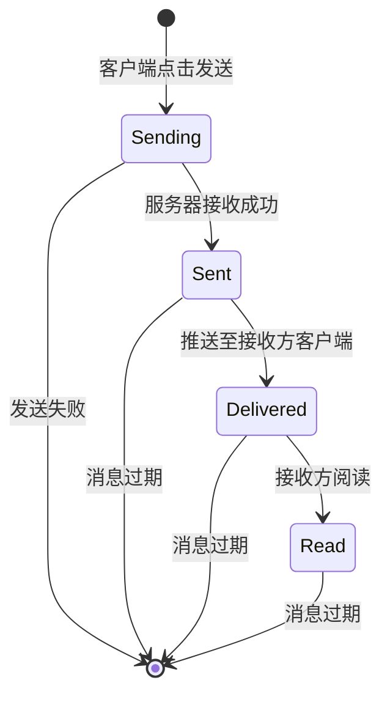

# 消息状态机图

## 消息生命周期说明

### 状态定义

1. **Sending（发送中）**：
   - 客户端点击发送，消息正在上传到服务器的过程中
   - 此时客户端显示“发送中”状态

2. **Sent（已发送）**：
   - 服务器已成功接收并存储了这条消息
   - 此时可以给发送方一个“发送成功”的提示

3. **Delivered（已送达）**：
   - 消息已被成功推送到接收方的某个客户端
   - 表示消息已经到达接收方设备

4. **Read（已读）**：
   - 接收方已经阅读了这条消息
   - 发送方可以看到消息已被阅读的状态

### 状态转换

- **[*] → Sending**：客户端点击发送按钮，开始上传消息
- **Sending → Sent**：服务器成功接收并存储消息
- **Sent → Delivered**：消息通过推送服务送达接收方客户端
- **Delivered → Read**：接收方打开并阅读消息
- **Sending → [*]**：发送过程中出现网络错误等导致发送失败
- **Sent → [*]**：消息超过保存期限被系统清理
- **Delivered → [*]**：消息超过保存期限被系统清理
- **Read → [*]**：消息超过保存期限被系统清理

### 实现建议

- 在Message实体的status字段中存储当前消息状态
- 使用WebSocket或其他实时通信方式实现状态更新
- 对于群聊场景，需要考虑不同接收方的阅读状态
- 实现消息状态的持久化存储，确保客户端重新连接后能恢复状态